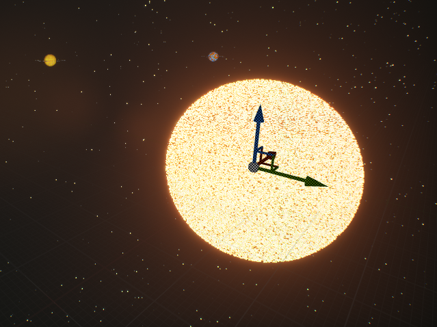
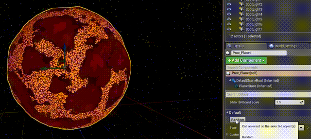

<h1 align="center"><code>ft_galaxy</code></h1>

  Written by <a href="https://profile.intra.42.fr/users/lde-la-h">lde-la-h@student.codam.nl</a>

---

## To infinity and beyond!

    

## Foreword

Have you ever watched the movie Wall-E? No? Leave and come back when you did. I'll wait. If you did watch it Wall-E, congrats! You finished the project.

Kidding aside, it is the perfect movie to inspire you; especially the first [few seconds](https://www.youtube.com/watch?v=nLx_7wEmwms). Also checkout Stellaris, Elite Dangerous and Spore while you're at it, spoiler alert, they all contain galaxies.

Heres a fun fact, our galaxy the milkyway has an estimated visible diameter of 100,000–200,000 light-years. Additionally it hosts roughly 100-400 billion stars. Your galaxy will not have that many stars of course, you wouldn't want to make your GPU cry in agony.

Are you inspired yet? Good. Lets get started.

## Introduction

In this project you will become a god and create your very own galaxy from scratch! Using any engine you want (Unity, Unreal Engine, your own, ...)

A good place to start with some information can be found [here.](https://www.youtube.com/channel/UCmtyQOKKmrMVaKuRXz02jbQ)

## Objectives

The objective of this project is to create a realtime galaxy creation game that provides an interface which lets you change the state of the galaxy. You will learn about batch rendering, LOD's, particle systems (fog/volumetrics) and ways on how to optimize rendering lots of objects on the screen without degrading peformance.

## General instructions

### The Basics

- This project was initially designed in Unreal Engine 4, but you can use any game engine (such as Unity, your own, ...) and its associated scripting language.

- There is no enforced coding style for this project. It is still recommended to adopt an existing coding style for clarity.
  
- You must sort out your project assets in folders. Each folder will contain just one type of asset. For instance: "Scripts/", "Scenes/", "Sprites/", "Prefabs/", "Sounds/", "Models/", ...
  
- You are not allowed to download any assets from an Asset Store, scripts included. You’re supposed to write/make everything you turn-in. You can use your game engine's standard assets.
  
### The Evaluation

- The evaluation will be a peer-evaluation.
  
- For the evaluation, you will have to build the game to test it. The evaluator will build the game, so you have to push all the necessary elements. Thus, your project must be accurately configured for the build. There will be no last minute setting.

---

## Mandatory part

### V.1

The player should be able to orbit around the galaxy, allowing them to rotate inorder change to a different perspective. They should also be able to zoom in/out from the core. Optionally you can also use the mouse to click somewhere and the player controller should move to that position.

The game should also present the player with a GUI that gives the ability to define certain parameters such as:

- Shape
- Amount of stars
- Scale
- Color
- (Anything else that might need changing)

Feel free to change the names of these parameters to something reasonably different, the goal is to just expose certain parameteres that change the visual look of the galaxy.

    

---

### V.2

Your galaxy should have noticable features such as:

- Dense core:
  - As you travel down from one of the arms of the galaxy towards the end, the density/number of stars should be reduced. You should avoid making the end of the arm look like a sudden stop.

- Oval in shape:
  - When looking from the side you should be able to recognize that its slightly sloping towards the middle, starting from the center.
  - This will make it look visually nicer more appealing as without this step your galaxy will look quite thick from a side view.

- Make them sparkle:
  - Stars should have slightly noticable animaton, as in, they should sparkle. This should be achieved within a shader.

- Add some color:
  - There should be at least 3, or more, recognizable colors for stars. Meaning they should not share the same color, for instance, every star being yellow or red.

    

---

### V.3

Lets make your galaxy pretty!

Its time to get into particle systems and make some fog to simulate nebulas. The player should also be able to customize the color via the GUI. If possible try to make them volumetric.

> Performance in this section is crucial! So be smart on how to create the particle system, do not just simply create a bunch of emitters everywhere.

Last but not least the player should be able save/export the current settings into a file format which you can then, again, load/import those settings to recreate the galaxy. Feel free to use any format you like.

Finally, make sure to implement some LOD's for your models, needles to say your game should not stutter or lag.

---

## Bonus

You can go crazy with the bonus!

Here are some ideas you could include, making the game more fun:

- Allow the player to travel from star to star! Maybe even implement a pathing algorithm to travel much more conveniently from A to B.

- Every star should generate a sol system that can be a binary system, trinary, ... and they should also generate X amount of planets which can be habitable, unhabitable, gas planet. The player can then visit those systems and within the system, maybe make them orbit the sun as well?

- Anything else you think is a nice addition.

    
    

## Turn-in and peer-evaluation

As usual, turn in your work on your repo GiT. Only the work included on your repo will be reviewed during the evaluation.
